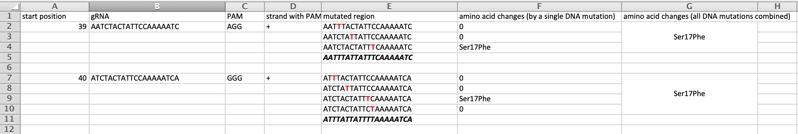
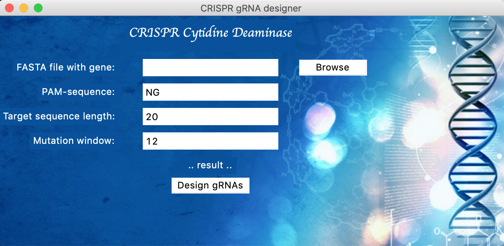
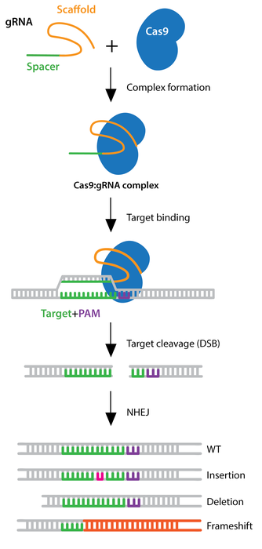
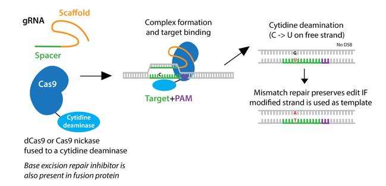

# gRNA designer for CRISPR cytidine deaminase

This repository contains open-source tools for gRNA design for CRISPR cytidine deaminase.

## Examples of outputs
You will only need a fasta file with your gene of interest that you want to design gRNA to perform subsequent mutations with CRISPR cytidine deaminase. As a result of running this program, you will get an Excel file with a list of:

* gRNA sequences
* corresponding PAM sequences
* relative start position of gRNA match in the edited gene 
* DNA strand information - <i>positive</i> (with PAM sequence) or <i>negative</i> (opposite) strand
* mutated DNA region, with C->T mutation highlighed in red
* amino acid changes in the resulting protein (results shown for each possible nucleotide edit individually and edits combined)

 

## How to run
### From terminal
Get a fasta file with the gene that you want to mutate with CRISPR Cytidine deaminase. Put your fasta file in the same folder together with bash_design.py and design_library.py.

Run in terminal:

```bash
python bash_design.py ALG7_genomic.fsa NGG 20 12
```
where 
* ALG7_genomic.fsa - fasta filename
* NGG - PAM sequence
* 20 - target sequence length
* 12 - CRISPR cytidine deaminae mutation window

### As a program with GUI
 
Get a fasta file with the gene that you want to mutate with CRISPR Cytidine deaminase. Download the repository; put your fasta file in the same folder with gRNA_designer.py, gRNA_designer.command and design_library.py. 

After that either:

- double-click on gRNA_designer.command

- run 
```bash
python gRNA_designer.py
```

An application with GUI should appear.

## Biology overview
### CRISPR-Cas9
CRISPR-Cas9 is a molecular system that can target specific DNA sequences and make cuts, allowing to perform genome editing by "turning off" some genes. 

CRISPR stands for <i>clustered regularly interspaced short palindromic repeats</i> - short DNA sequences originally found in bacteria, which serve as bacterial immune system and participate in anti-viral defence [1]. In bacterial cell these sequences are transcribed into short RNA sequences that guide the CRISPR-Cas9 system to matching sequences of DNA of the invading virus. Once target DNA is found, protein Cas9 performs a cut and blocks a target gene. This mechanism of defence allows bacteria to protect against viruses by turning off their important genes and, hence, killing the virus.

 
(images borrowed from Addgene)


## CRISPR as genome editing tool
In 2013 the first CRISPR system was engineered to perform genome editing in mouse and human cells [2]. After that, the system became widely used in biomedical laboratories across the world as a genome editing tool.

The principle behing genome editing with CRISPR is "find and edit". Cas9 protein is matched with a specifically engineered **guide RNA** (or gRNA) that allows the system to find a DNA sequence that we want to edit. After complementary DNA is found, Cas9 protein cuts it. Instead of using Cas9, we can also use other DNA-editing proteins (like Cytidine deaminase).

### Cytidine deaminase
 

To overcome cutting the DNA with Cas9, researchers have developed a CRISPR-based system that allows to change a nucleotide in DNA that will result in subsequent mutation in the expressed protein. Cytidine base editors are engineered by fusing catalytically inactive "dead" Cas9 to a cytidine deaminase. CRISPR Cytidine deaminase system is targeted to a specific locus on DNA by its gRNA, where Cytidine deaminase performs a C -> T change on one DNA strand (G to A on the opposite strand). C to T conversion is bounded by a small editing window near PAM site on a locus determined by gRNA.

# Gene examples and outputs
Go to folder <i>gene examples</i> to download fasta files with gene sequences and see Excel outup examples.

